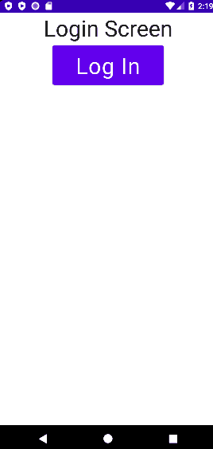

# Simple Jetpack Compose Navigation Example


## Requirements
- Android Studio Flamingo or later

## Tech Stack
- Jetpack Compose
- Navigation Compose
- Compose Destination

## Articles
- [Simple Jetpack Compose Navigation Example](https://vtsen.hashnode.dev/simple-jetpack-compose-navigation-example)
- [Compose Destinations - Navigation Library](https://vtsen.hashnode.dev/compose-destinations-navigation-library)
- [How to Add Bottom Navigation in Jetpack Compose?](https://vtsen.hashnode.dev/how-to-add-bottom-navigation-in-jetpack-compose)
- [How to Add Navigation Drawer in Jetpack Compose?](https://vtsen.hashnode.dev/how-to-add-navigation-drawer-in-jetpack-compose)
- [How to Add Deep Links in Jetpack Compose?](https://vtsen.hashnode.dev/how-to-add-deep-links-in-jetpack-compose)

## Branches
- [master](https://github.com/vinchamp77/Demo_SimpleNavigationCompose/tree/master) - Basic Compose Navigation
- [compose_destinations](https://github.com/vinchamp77/Demo_SimpleNavigationCompose/tree/compose_destinations) -  Basic Compose Navigation (Using [Compose Destinations](https://github.com/raamcosta/compose-destinations/) library)
- [bottom_nav](https://github.com/vinchamp77/Demo_SimpleNavigationCompose/tree/bottom_nav) - Bottom Navigation
- [bottom_nav_drawer](https://github.com/vinchamp77/Demo_SimpleNavigationCompose/tree/bottom_nav_drawer) - Bottom Navigation + Navigation Drawer
- [deeplink](https://github.com/vinchamp77/Demo_SimpleNavigationCompose/tree/deeplink) - Deep Link Example

## License
```
Copyright 2023 Vincent Tsen

Licensed under the Apache License, Version 2.0 (the "License");

you may not use this file except in compliance with the License.
You may obtain a copy of the License at

http://www.apache.org/licenses/LICENSE-2.0

Unless required by applicable law or agreed to in writing, software
distributed under the License is distributed on an "AS IS" BASIS,
WITHOUT WARRANTIES OR CONDITIONS OF ANY KIND, either express or implied.
See the License for the specific language governing permissions and
limitations under the License.
```
